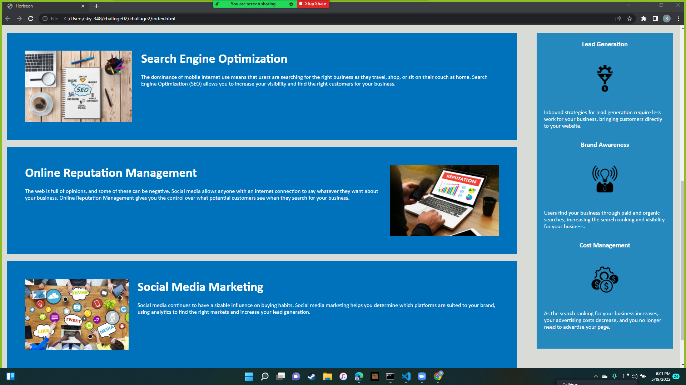
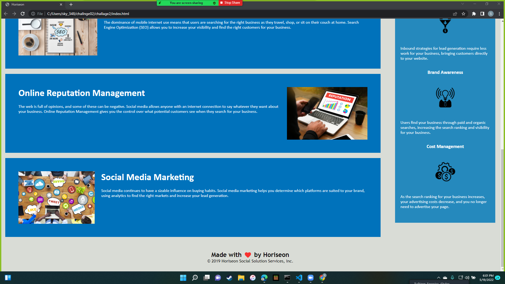

# Horiseon
1. Changed html tags to be more symantic (div,footer).
2. Added type attribute to link tag.
3. Changes web page title to just horiseon.
4. Changed/deleted class names (box is knew class name) to consolodate css page.
5. Added alts to image tags for accesability. 
6. Changes classes to html tag selectors to consolodate.
7. Conolodaded repedative class selectors. 
[deployed project](https://sklylerf.github.io/challage2/)

[git hub repository](https://github.com/SklylerF/challage2/)

